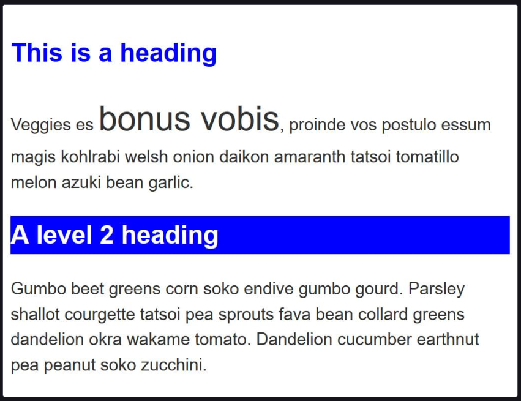
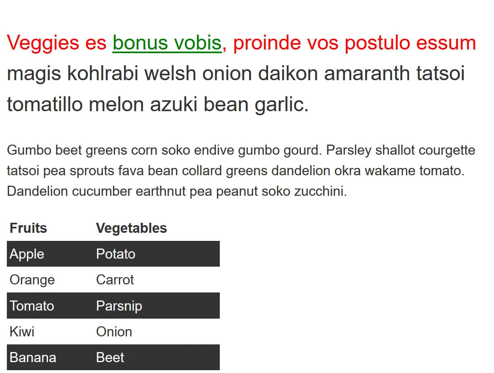

## Selectors One

### Without changing the HTML, use CSS to do the following things:

- Make h1 headings blue.
- Give h2 headings a blue background and white text.
- Cause text wrapped in a span to have a font-size of 200%.

---

## Selectors Two

### Without changing the HTML, make the following changes to the look of the content in this example:

- Give the element with an id of special a yellow background.
- Give the element with a class of alert a 1px grey border.
- If the element with a class of alert also has a class of stop, make the background red.
- If the element with a class of alert also has a class of go, make the background green.

---

## Selectors Three

### In this example, try making the following changes without adding to the HTML.

- Style links, making the link-state orange, visited links green, and remove the underline on hover.
- Make the first element inside the container font-size: 150% and the first line of that element red.
- Stripe every other row in the table by selecting these rows and giving them a background color of #333 and foreground of white.

---

## Selectors Four

### In this task try the following:

- Make any paragraph that directly follows an h2 element red.
- Remove the bullets and add a 1px grey bottom border only to list items that are a direct child of the ul with a class of list.

---

## Selectors Five

### In this final task add CSS using attribute selectors to do the following:

- Target the <a> element with a title attribute and make the border pink (border-color: pink).
- Target the <a> element with an href attribute that contains the word contact somewhere in its value and make the border orange (border-color: orange).
- Target the <a> element with an href value starting with https and give it a green border (border-color: green).

